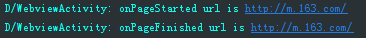
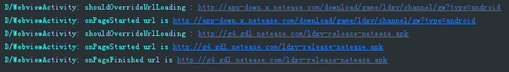
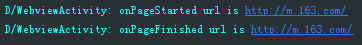
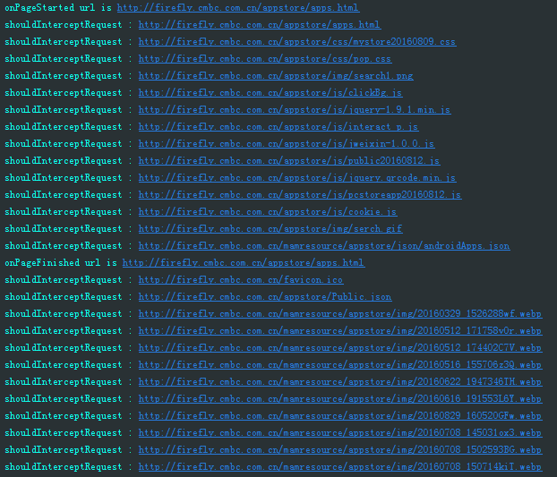
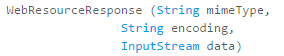
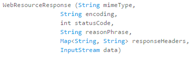

&nbsp;&nbsp;&nbsp;&nbsp;&nbsp;&nbsp;&nbsp;&nbsp;在Android自带的WebView中，如果需要对访问的URL或者资源进行拦截，主要涉及到WebViewClient中的三个方法：onPageStarted、shouldOverrideUrlLoading、shouldInterceptRequest。
&nbsp;&nbsp;&nbsp;&nbsp;&nbsp;&nbsp;&nbsp;&nbsp;首先来分析onPageStarted方法和shouldOverrideUrlLoading方法，分别在两个方法以及onPageFinished方法中打印log。
###### 情形一
&nbsp;&nbsp;&nbsp;&nbsp;&nbsp;&nbsp;&nbsp;&nbsp;当用户使用WebView的loadUrl方法开启一个网页时，其中onPageStarted方法会执行，而shouldOverrideUrlLoading则不会执行，如下图：

###### 情形二
&nbsp;&nbsp;&nbsp;&nbsp;&nbsp;&nbsp;&nbsp;&nbsp;当用户继续点击网页内的链接时，onPageStarted和shouldOverrideUrlLoading均会执行，并且shouldOverrideUrlLoading要先于onPageStarted方法执行，如下图：

###### 情形三
&nbsp;&nbsp;&nbsp;&nbsp;&nbsp;&nbsp;&nbsp;&nbsp;当用户点击网页中的链接后，点击back，返回历史网页时，onPageStarted会执行，而shouldOverrideUrlLoading不会执行，如下图：

&nbsp;&nbsp;&nbsp;&nbsp;&nbsp;&nbsp;&nbsp;&nbsp;综上所述，当需要对访问的网页进行策略控制时，需要在onPageStarted方法中进行拦截，如下示例代码:

    @Override
    public void onPageStarted(WebView view, String url, Bitmap favicon) {  
        Log.d(TAG, "onPageStarted url is " + url);
        boolean res = checkUrl(url);
        //根据对URL的检查结果，进行不同的处理，
        //例如，当检查的URL不符合要求时，
        //可以加载本地安全页面，提示用户退出
        if (!res) {
            //停止加载原页面
            view.stopLoading();
            //加载安全页面
            view.loadUrl(LOCAL_SAFE_URL);
        }
    }                                                                      
&nbsp;&nbsp;&nbsp;&nbsp;&nbsp;&nbsp;&nbsp;&nbsp;然后，来分析一下shouldInterceptRequest(WebView view, String url)，此方法从Android API 11（3.0）开始提供，位于WebViewClient 内，当用户使用WebView的loadUrl方法打开网页、点击网页中的链接、返回历史网页时，所有资源的加载均会调用shouldInterceptRequest方法，测试访问“http://firefly.cmbc.com.cn/appstore/apps.html”如下图：

&nbsp;&nbsp;&nbsp;&nbsp;&nbsp;&nbsp;&nbsp;&nbsp;可以看到网页中加载的html、js、css、gif、png、webp等资源，全部会调用此方法。因此，开发者可以在此方法中对网页中加载的资源进行拦截，构造WebResourceResponse对象返回，以此来加载本地缓存的资源。WebResourceResponse的构造函数如下：
###### 1.

&nbsp;&nbsp;&nbsp;&nbsp;&nbsp;&nbsp;&nbsp;&nbsp;其中：

<table>
    <tr>
        <td>参数</td>
        <td>说明</td>
    </tr>
    <tr>
        <td>mimeType</td>
        <td>String类型，资源的MIME类型，例如text/html，image/png，text/css</td>
    </tr>
    <tr>
        <td>encoding</td>
        <td>String类型，资源Response的编码格式，例如UTF-8</td>
    </tr>
    <tr>
        <td>data</td>
        <td>InputStream类型，资源Response的输入流，不能是StringBufferInputStream</td>
    </tr>
</table>
###### 2.

&nbsp;&nbsp;&nbsp;&nbsp;&nbsp;&nbsp;&nbsp;&nbsp;其中：

<table>
    <tr>
        <td>参数</td>
        <td>说明</td>
    </tr>
    <tr>
        <td>mimeType</td>
        <td>String类型，资源的MIME类型，例如text/html，image/png，text/css</td>
    </tr>
    <tr>
        <td>encoding</td>
        <td>String类型，资源Response的编码格式，例如UTF-8</td>
    </tr>
      <tr>
        <td>statusCode</td>
        <td>int类型，状态码，必须在[100,299][400,599]之间，3XX的不支持</td>
    </tr>
      <tr>
        <td>reasonPhrase</td>
        <td>String类型，描述状态码的语言，例如“确定”，必须是非空的</td>
    </tr>
      <tr>
        <td>responseHeaders</td>
        <td>Map类型，资源Response的头部</td>
    </tr>
    <tr>
        <td>data</td>
        <td>InputStream类型，资源Response的输入流，不能是StringBufferInputStream</td>
    </tr>
</table>
&nbsp;&nbsp;&nbsp;&nbsp;&nbsp;&nbsp;&nbsp;&nbsp;进行资源替换时，可以将网页资源，例如html、css、js、图片等存放在本地，在shouldInterceptRequest对WebView加载的资源进行拦截，当符合某种策略时，替换为本地的资源，资源的MIME类型可以采用以下方法获取：
<code>MimeTypeMap.getSingleton().getMimeTypeFromExtension(MimeTypeMap.getFileExtensionFromUrl(url))</code>
&nbsp;&nbsp;&nbsp;&nbsp;&nbsp;&nbsp;&nbsp;&nbsp;获取本地资源的InputStream有两种方式：
###### 方式一
&nbsp;&nbsp;&nbsp;&nbsp;&nbsp;&nbsp;&nbsp;&nbsp;使用打开文件的方式，获取FileInputStream，如下，替换网页中的jpg图片资源，示例代码如下：
    
    @Override
    public WebResourceResponse shouldInterceptRequest(WebView view, String url) {
        Log.d(TAG, "shouldInterceptRequest : " + url);
        if (url.toLowerCase().endsWith(".jpg")) {
            try {
                String picName = url.substring(url.lastIndexOf("/"));
                File file = new File(Environment.getExternalStorageDirectory().getAbsolutePath() + "/www/netease" + picName);
                FileInputStream fis = new FileInputStream(file);
                WebResourceResponse response = new WebResourceResponse(
                    MimeTypeMap.getSingleton().getMimeTypeFromExtension(MimeTypeMap.getFileExtensionFromUrl(url))
                            , "UTF-8", fis);
                Log.d(TAG, "shouldInterceptRequest : replace " + MimeTypeMap.getFileExtensionFromUrl(url));
                return response;
                } catch (IOException e) {
                    e.printStackTrace();
            }
        }
        return super.shouldInterceptRequest(view, url);
    }
&nbsp;&nbsp;&nbsp;&nbsp;&nbsp;&nbsp;&nbsp;&nbsp;当本地文件不存在时，会抛出IOException，使用return null或者return super. shouldInterceptRequest(view, url)来返回，此时，WebView会加载原来的网络资源，这样可以不影响用户使用，增强用户体验。
###### 方式二
    @Override
    public WebResourceResponse shouldInterceptRequest(WebView view, String url) {
        Log.d(TAG, "shouldInterceptRequest : " + url);
        Uri uri = Uri.parse(url);
        String localPath = "file://" + Environment.getExternalStorageDirectory().getAbsoluteFile() + "/www" + uri.getPath();
        File file = new File(localPath);
        try {
            URL localUri = new URL(localPath);
            if (localUri != null) {
                InputStream is = localUri.openConnection().getInputStream();
                WebResourceResponse resourceResponse = new WebResourceResponse(
                            MimeTypeMap.getSingleton().getMimeTypeFromExtension(MimeTypeMap.getFileExtensionFromUrl(url))
                            , "UTF-8", is);
                Log.d(TAG, "replace " + MimeTypeMap.getFileExtensionFromUrl(url));
                return resourceResponse;
            }
        } catch (IOException e) {
            e.printStackTrace();
        }
        return super.shouldInterceptRequest(view, url);
    }

&nbsp;&nbsp;&nbsp;&nbsp;&nbsp;&nbsp;&nbsp;&nbsp;采用URLConnection的getInputStream的方式得到InputStream，注意，此时需要访问本地资源时，需要以file://开头，这样构造的URL对象才能访问到本地资源，同样的，当本地资源不存在时，会抛出IOExcetption，WebView将会加载原来的网络资源。
##### *注意*
&nbsp;&nbsp;&nbsp;&nbsp;&nbsp;&nbsp;&nbsp;&nbsp;shouldInterceptRequest方法是在**非UI线程**中调用的，因此，不要在此方法中进行任何UI操作。