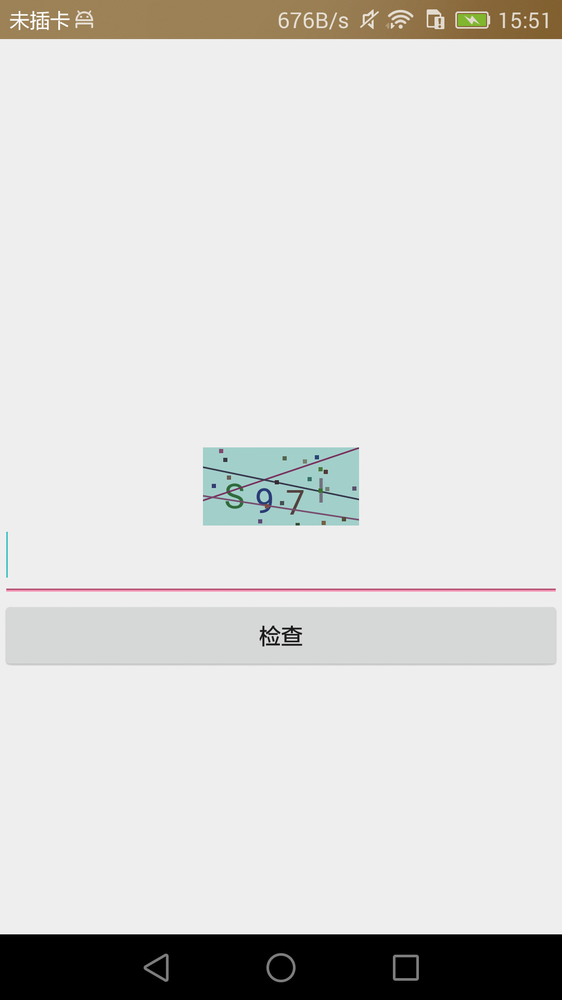
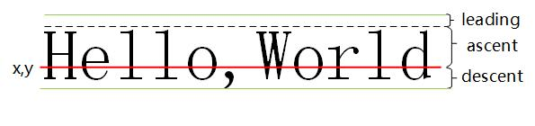

###自定义View——验证码
&nbsp;&nbsp;&nbsp;&nbsp;RandomCodeView：自定义控件，主要功能是实现本地图形验证码，本段时间学习了Android自定义View，采用图形验证码来练手，先来个效果图，如下：

&nbsp;&nbsp;&nbsp;&nbsp;使用如下：

    <com.example.wz.anytestdemo.view.RandomCodeView
        android:id="@+id/randomCodeView"
        android:layout_width="100dp"
        android:layout_height="50dp"
        android:layout_centerInParent="true"/>

&nbsp;&nbsp;&nbsp;&nbsp;RandomCodeView具有验证码点击刷新、验证等功能，基于自定义View实现，自定义View的分为measure、layout、draw三个过程，即测量、布局、绘制，分别对应onMeasure()、onLayout()、onDraw()三个方法，measure确定自定义View的宽度和高度，layout确定自定义View最终布局的宽度和高度以及四个顶点的位置，draw将自定义View会知道屏幕上，RandomCodeView主要分为以下几个部分： 
*处理WRAP_CONTENT* 
*验证码字体大小测算* 
*验证码绘制* 
*点击事件* 
*验证码结果验证* 

####处理WRAP_CONTENT
&nbsp;&nbsp;&nbsp;&nbsp;当使用自定义View指定宽度和高度为wrap_content时，即为AT_MOST模式，此时自定义View的大小为父容器的大小，因此需要对wrap_content进行处理，以达到预期效果。处理如下：

    @Override
    protected void onMeasure(int widthMeasureSpec, int heightMeasureSpec) {
        //处理wrap_content问题
        super.onMeasure(widthMeasureSpec, heightMeasureSpec);
        int widthSpecMode = MeasureSpec.getMode(widthMeasureSpec);
        int widthSpecSize = MeasureSpec.getSize(widthMeasureSpec);
        int heightSpecMode = MeasureSpec.getMode(heightMeasureSpec);
        int heightSpecSize = MeasureSpec.getSize(heightMeasureSpec);
        if (widthSpecMode == MeasureSpec.AT_MOST && heightSpecMode == MeasureSpec.AT_MOST) {
            setMeasuredDimension(200, 100);
        } else if (widthSpecMode == MeasureSpec.AT_MOST) {
            setMeasuredDimension(200, heightSpecSize);
        } else if (heightSpecMode == MeasureSpec.AT_MOST) {
            setMeasuredDimension(widthSpecSize, 100);
        }
        ........................

&nbsp;&nbsp;&nbsp;&nbsp;在onMeasure()方法中，获取宽/高的SpecMode，分别判断宽/高的SpecMode是否为AT_MOST,若为AT_MOST，则指定宽/高的大小，否则，为指定的大小。
#####***
#####Tips:getHeight()方法和getMeasuredHeight()方法的区别？
&nbsp;&nbsp;&nbsp;&nbsp;两者获取的结果单位均为px（像素），getHeight()方法获取的为View在屏幕上显示的高度，getMeasuredHeight()方法获取的为View的原始测量高度，当屏幕大小可以包裹内容时，两者相同，当View的高度超出屏幕大小时：
getHeight() = getMeasuredHeight() + View高度超出屏幕的部分
#####***

####验证码字体大小测算
&nbsp;&nbsp;&nbsp;&nbsp;在onMeasure()方法里面进行字体大小的测算，代码如下：

    @Override
    public void onMeasure(int widthMeasureSpec, int heightMeasureSpec){
        //.........................
        mHeight = getHeight();
        mWidth = getWidth();
        mTextSize = (int) ((float) mWidth / 4.5);
        //如果高度小于字体大小，则字体高度为0.5倍的view高度，防止字体超出view大小
        if (mHeight < mTextSize) {
            mTextSize = (int) (0.5 * mHeight);
        }
    }

&nbsp;&nbsp;&nbsp;&nbsp;通过getHeight()和getWidth()方法获取View的实际显示高度，考虑到需要4个验证码字符，以及3个空格，经过实际实验，采用View宽度除以4.5，以得到验证码字体大小，同时，需要判断是否会出现高度过小的情况，如果高度过小，则字体高度为0.5倍的View高度，防止验证码溢出高度。

####View的绘制过程
&nbsp;&nbsp;&nbsp;&nbsp;在onDraw()方法里面进行自定义View的绘制，在View对象创建时，此时无法得知View的大小，刚开始获取的宽/高为0，为了防止此时开始绘制验证码，首先需要判断当前mHeight和mWidth是否为0。然后，开始初始化画笔，设置画笔Paint绘制字体的大小，笔触的宽度等等：
    
    //去锯齿
    mPaint.setAntiAlias(true);
    //设置字体大小,单位px
    mPaint.setTextSize(mTextSize);
    //设置笔触宽度
    mPaint.setStrokeWidth(3);
    //设置阴影为null
    mPaint.setShader(null);

&nbsp;&nbsp;&nbsp;&nbsp;下一步就是生成随机验证码、字体颜色以及背景颜色等，由于onDraw()方法会被调用多次，因此设置一个flag，标识是否已经初始化参数完成，代码如下：
    
    Paint.FontMetrics fontMetrics = mPaint.getFontMetrics();
    //获取字体高度
    float textHeight = Math.abs(fontMetrics.ascent) + fontMetrics.descent;
    Log.d(TAG, "textHeight : " + textHeight);
    if (!flag) {
        //初始化各种随机参数，定义flag，防止频繁调用onDraw刷新数据
        init(fontMetrics, mHeight);
    }

&nbsp;&nbsp;&nbsp;&nbsp;init()方法如下：
    
    /**
     * init 初始化各种随机参数
     *
     * @param textHeight 文字高度
     * @return void
     * @api 6
     * @since 3.1.0
     */
    private void init(Paint.FontMetrics fontMetrics, float textHeight) {
        mRandom = new Random(System.currentTimeMillis());
        mBgColor = getBgRandomColor();
        //获取随机码Y位置
        for (int i = 0; i < 4; i++) {
            mYs[i] = getRandomY(fontMetrics, mHeight);
            mCodes[i] = getRandomText();
            mColors[i] = getTextRandomColor();
        }       
        flag = true;
    }
   
&nbsp;&nbsp;&nbsp;&nbsp;自定义View在绘制字体时，调用drawText()方法:

    public void drawText(@NonNull String text, float x, float y, @NonNull Paint paint);

&nbsp;&nbsp;&nbsp;&nbsp;其中想x,y为字体baseLine(基线)的坐标，如下图示意：

&nbsp;&nbsp;&nbsp;&nbsp;其中： 
&nbsp;&nbsp;&nbsp;&nbsp;&nbsp;&nbsp;&nbsp;&nbsp;leading：为文本之间额外的距离，测试发现，一般为0.0 
&nbsp;&nbsp;&nbsp;&nbsp;&nbsp;&nbsp;&nbsp;&nbsp;ascent：为baseLine到字体最高点的距离，为负值 
&nbsp;&nbsp;&nbsp;&nbsp;&nbsp;&nbsp;&nbsp;&nbsp;descent：为baseLine到字体最低点的距离 
&nbsp;&nbsp;&nbsp;&nbsp;据此，可以得出字体高度为：

    //获取字体高度
    float textHeight = Math.abs(fontMetrics.ascent) + fontMetrics.descent;

&nbsp;&nbsp;&nbsp;&nbsp;同时，验证码要随机显示位置，随机的位置应该为(ascent, view高度-descent)，因此，随机位置y的方法如下：
     
     /**
     * getRandomY 获取文字Y坐标位置，y为文字baseline坐标
     * 从 ascent到height-descent之间随机
     *
     * @param fontMetrics
     * @param height
     * @return float
     * @api 6
     * @since 3.1.0
     */
    private float getRandomY(Paint.FontMetrics fontMetrics, int height) {
        int min = (int) (height - Math.abs(fontMetrics.ascent) - fontMetrics.descent);
        return mRandom.nextInt(min) + Math.abs(fontMetrics.ascent);
    }

&nbsp;&nbsp;&nbsp;&nbsp;同时，需要随机产生四个验证码，选取0-9,A-Z,由于，9和A之间还有其他特殊字符，因此需要在产生随机结果时进行判断，是否符合要求：

    /**
     * getRandomText 获取单个随机字符,0-9, A-Z
     *
     * @param
     * @return java.lang.String
     * @api 6
     * @since 3.1.0
     */
    private char getRandomText() {
        int i = mRandom.nextInt(42) + 48;
        while (i > 57 && i < 65) {
            i = mRandom.nextInt(42) + 48;
        }
        char tmp = (char) (i);
        return tmp;
    }

&nbsp;&nbsp;&nbsp;&nbsp;随机产生验证码颜色以及背景颜色，注意两种颜色不要重叠：
    
    /**
     * getBgRandomColor 获取随机背景颜色
     *
     * @param
     * @return int
     * @api 6
     * @since 3.1.0
     */
    private int getBgRandomColor() {
        int r = mRandom.nextInt(140) + 115;
        int g = mRandom.nextInt(140) + 115;
        int b = mRandom.nextInt(140) + 115;
        return Color.rgb(r, g, b);
    }
    /**
     * getTextRandomColor 获取随机颜色
     *
     * @param
     * @return int
     * @api 6
     * @since 3.1.0
     */
    private int getTextRandomColor() {
        int r = mRandom.nextInt(90) + 40;
        int g = mRandom.nextInt(90) + 40;
        int b = mRandom.nextInt(90) + 40;
        return Color.rgb(r, g, b);
    }

&nbsp;&nbsp;&nbsp;&nbsp;初始化验证码各项参数之后，设置View的背景颜色，调用drawText方法进行绘制：

    //设置背景色
    setBackgroundColor(mBgColor);
    //起始x位置
    String drawText = "A B C D";
    float startX = (mWidth - mPaint.measureText(drawText)) / 2;
    //画四个随机字母，每个字母随机颜色
    for (int i = 0; i < 4; i++) {
        mPaint.setColor(mColors[i]);
        float x = startX + i * mPaint.measureText("A ");
        if (i == 3) {
            canvas.drawText(String.valueOf(mCodes[i]), x, mYs[i], mPaint);
        } else {
            canvas.drawText(mCodes[i] + " ", x, mYs[i], mPaint);
        }
    }

&nbsp;&nbsp;&nbsp;&nbsp;调用Paint的measureText方法能够获取绘制字体的宽度，使用View的宽度减去绘制字体的宽度，之后得到绘制字体两边的富余宽度，除以2即为开始绘制的位置，同时，每绘制一个验证码，绘制一个空格，之后将绘制的x位置依次右移。
画完验证码后，为了增加验证难度，可以绘制几条干扰线以及干扰点，干扰线的起始x位置为0到View的宽度，y位置的起始和结束作为为View的高度随机产生，干扰点的坐标也是在View的宽/高中随机产生，如下：
    
    //画三条干扰线，颜色和位置也可以提前初始化
    for (int i = 0; i < 3; i++) {
        mPaint.setColor(getTextRandomColor());
        canvas.drawLine(0, mRandom.nextInt(mHeight), mWidth, mRandom.nextInt(mHeight), mPaint);
    }
    mPaint.setStrokeWidth(8);
    //画20个干扰点
    for (int i = 0; i < 20; i++) {
        mPaint.setColor(getTextRandomColor());
        canvas.drawPoint(mRandom.nextInt(mWidth), mRandom.nextInt(mHeight), mPaint);
    }

&nbsp;&nbsp;&nbsp;&nbsp;为了防止多次调用onDraw()方法导致干扰点和干扰线的位置以及颜色变化，可以像初始化验证码的字体颜色一样，提前初始化好，定义一个flag，防止多次变化。
####其他方法
&nbsp;&nbsp;&nbsp;&nbsp;点击事件，当用户点击验证码View时，重新随机验证码及绘制：

    //点击事件
    this.setOnClickListener(new OnClickListener() {
        @Override
        public void onClick(View v) {
            //清空数据
            flag = false;
            //重绘
            invalidate();
        }
    });

&nbsp;&nbsp;&nbsp;&nbsp;设置验证验证码方法以及刷新验证码方法：

     /**
     * checkRes 检查用户输入结果
     *
     * @param code
     * @return boolean
     * @api 6
     * @since 3.1.0
     */
    public boolean checkRes(String code) {
        if (TextUtils.isEmpty(String.valueOf(mCodes)) || TextUtils.isEmpty(code)) {
            return false;
        }
        if (String.valueOf(mCodes).toLowerCase().equals(code.trim().toLowerCase())) {
            return true;
        }
        return false;
    }
    /**
     * refresh 刷新页面方法
     *
     * @param
     * @return void
     * @api 6
     * @since 3.1.0
     */
    public void refresh() {
        flag = false;
        //重绘
        invalidate();
    }

&nbsp;&nbsp;&nbsp;&nbsp;详细源码见：
<a href="https://github.com/WangZzzz/RandomCodeView/">RandomCodeView</a>