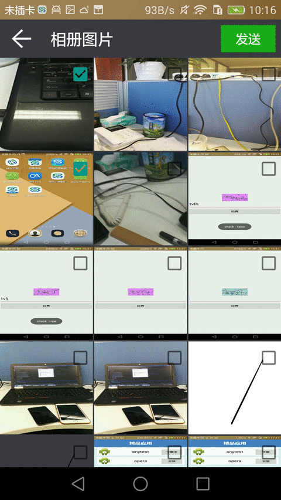

##Android——一次选取本地相册多张图片
&nbsp;&nbsp;&nbsp;&nbsp;&nbsp;&nbsp;&nbsp;&nbsp;由于项目需求，需要上传一些图片信息到服务器，以前的方案是采用H5标签，但是只能一次选择一张图片，不太方便，需要一次选择多张图片上传，采用的方案是使用ContentResolver查询本地相册图片信息，然后采用GridView（ImageView+CheckBox）进行展示，同时，采用MVP模式进行开发，下面是效果图：

&nbsp;&nbsp;&nbsp;&nbsp;&nbsp;&nbsp;&nbsp;&nbsp;首先是模型类（M）：
    
    public class PhotoItem implements Parcelable {
        public String id;
        public String path;
        public boolean isChecked = false;
        public PhotoItem() {
        }
        public PhotoItem(String id, String path) {
            this.id = id;
            this.path = path;
        }
        @Override
        public int describeContents() {
            return 0;
        }
        @Override
        public void writeToParcel(Parcel dest, int flags) {
            dest.writeString(this.id);
            dest.writeString(this.path);
            dest.writeByte(this.isChecked ? (byte) 1 : (byte) 0);
        }
        protected PhotoItem(Parcel in) {
            this.id = in.readString();
            this.path = in.readString();
            this.isChecked = in.readByte() != 0;
        }
        public static final Parcelable.Creator<PhotoItem> CREATOR = new Parcelable.Creator<PhotoItem>() {
            @Override
            public PhotoItem createFromParcel(Parcel source) {
                return new PhotoItem(source);
            }
            @Override
            public PhotoItem[] newArray(int size) {
                return new PhotoItem[size];
            }
        };
    }

&nbsp;&nbsp;&nbsp;&nbsp;&nbsp;&nbsp;&nbsp;&nbsp;上传图片需要图片文件路径，同时需要要id去区别不同的图片，isChecked表示图片是否被选中上传。需要实现序列化接口，便于不同Activity之间的传递。

&nbsp;&nbsp;&nbsp;&nbsp;&nbsp;&nbsp;&nbsp;&nbsp;然后是View类，主要是PhotoPickActivity和IPhotoPickActivity接口，IPhotoPickActivity主要有四个方法：
    
    public interface IPhotoPickActivity {
        void showDialog();
        void hideDialog();
        void showErrorMessage(String errorMsg);
        void showPhotos(List<PhotoItem> photoItems);
    }

&nbsp;&nbsp;&nbsp;&nbsp;&nbsp;&nbsp;&nbsp;&nbsp;分别为显示加载Dialog、隐藏加载Dialog、显示错误信息以及显示从相册中查询到的照片。PhotoPickActivity需要实现这个接口。

&nbsp;&nbsp;&nbsp;&nbsp;&nbsp;&nbsp;&nbsp;&nbsp;PhotoPickActivity的布局如下：

    <?xml version="1.0" encoding="utf-8"?>
    <LinearLayout
        xmlns:android="http://schemas.android.com/apk/res/android"
        android:layout_width="match_parent"
        android:layout_height="match_parent"
        android:background="#393A3F"
        android:orientation="vertical">
        <RelativeLayout
            android:layout_width="match_parent"
            android:layout_height="wrap_content">
            <ImageButton
                android:id="@+id/btn_back"
                android:layout_width="wrap_content"
                android:layout_height="wrap_content"
                android:layout_alignParentLeft="true"
                android:layout_centerVertical="true"
                android:layout_marginLeft="10dp"
                android:background="@drawable/btn_back_icon"/>
            <TextView
                android:id="@+id/tv_title"
                android:layout_width="wrap_content"
                android:layout_height="wrap_content"
                android:layout_centerVertical="true"
                android:layout_marginBottom="10dp"
                android:layout_marginLeft="20dp"
                android:layout_marginTop="10dp"
                android:layout_toRightOf="@+id/btn_back"
                android:text="相册图片"
                android:textColor="@color/white"
                android:textSize="20sp"/>
            <Button
                android:id="@+id/btn_send_photo"
                android:layout_width="70dp"
                android:layout_height="35dp"
                android:layout_alignParentRight="true"
                android:layout_margin="7dp"
                android:background="@drawable/btn_green_selector"
                android:text="发送"
                android:textColor="@color/white"
                android:textSize="16sp"/>
        </RelativeLayout>
        <GridView
            android:id="@+id/gdv_photo"
            android:layout_width="match_parent"
            android:layout_height="match_parent"
            android:horizontalSpacing="2dp"
            android:numColumns="3"
            android:stretchMode="columnWidth"
            android:verticalSpacing="2dp"/>
    </LinearLayout>

&nbsp;&nbsp;&nbsp;&nbsp;&nbsp;&nbsp;&nbsp;&nbsp;主要为上面一个TitleBar加下面一个GridView。

&nbsp;&nbsp;&nbsp;&nbsp;&nbsp;&nbsp;&nbsp;&nbsp;业务逻辑类为PhotoBiz，在其中是查询相册信息，使用ContentResolver，查询的URI为： MediaStore.Images.Media.EXTERNAL_CONTENT_URI，在使用之前需要判断外置存储是否存在，查询出的结果按照拍摄时间降序排列：
    
    public class PhotoBiz {
        private Context mContext;
        public PhotoBiz(@NonNull Context context) {
            mContext = context;
        }
        public List<PhotoItem> getPhotoItems() {
            List<PhotoItem> items = new ArrayList<PhotoItem>();
            if (Environment.MEDIA_MOUNTED.equals(Environment.getExternalStorageState()) && !Environment.isExternalStorageRemovable()) {
                ContentResolver contentResolver = mContext.getContentResolver();
                Uri uri = MediaStore.Images.Media.EXTERNAL_CONTENT_URI;
                //根据拍摄时间降序排列
                Cursor cursor = contentResolver.query(uri, null, null, null, MediaStore.Images.Media.DATE_TAKEN + " DESC");
                if (cursor != null) {
                    while (cursor.moveToNext()) {
                        String id = cursor.getString(cursor.getColumnIndex(MediaStore.Images.Media._ID));
                        String data = cursor.getString(cursor.getColumnIndex(MediaStore.Images.Media.DATA));
                        PhotoItem photoItem = new PhotoItem(id, data);
                        items.add(photoItem);
                    }
                }
            }
            return items;
        }
    }   

&nbsp;&nbsp;&nbsp;&nbsp;&nbsp;&nbsp;&nbsp;&nbsp;PhotoPickPresenter为展示类（P）,主要是关联业务逻辑类和View，如下：

    public class PhotoPickPresenter {
        private Context mContext;
        private IPhotoPickActivity mIPhotoPickActivity;
        private PhotoBiz mPhotoBiz;
        private static final int MSG_GET_PHOTOS_SUC = 1;
        private static final int MSG_GET_PHOTOS_ERROR = -1;
        private List<PhotoItem> mPhotoItems;
        private Handler mHandler = new Handler() {
            @Override
            public void handleMessage(Message msg) {
                switch (msg.what) {
                    case MSG_GET_PHOTOS_ERROR:
                        mIPhotoPickActivity.hideDialog();
                        String errorMsg = (String) msg.obj;
                        mIPhotoPickActivity.showErrorMessage(errorMsg);
                        break;
                    case MSG_GET_PHOTOS_SUC:
                        mIPhotoPickActivity.hideDialog();
                        mIPhotoPickActivity.showPhotos(mPhotoItems);
                        break;
                }
            }
        };
        public PhotoPickPresenter(Context context, IPhotoPickActivity iPhotoPickActivity) {
            mContext = context;
            mIPhotoPickActivity = iPhotoPickActivity;
            mPhotoBiz = new PhotoBiz(context);
        }
        public void getData() {
            mIPhotoPickActivity.showDialog();
            ThreadPoolManager.getInstance().getThreadPool().execute(new Thread(new Runnable() {
                @Override
                public void run() {
                    mPhotoItems = mPhotoBiz.getPhotoItems();
                    if (mPhotoItems == null || mPhotoItems.size() == 0) {
                        Message message = Message.obtain();
                        message.what = MSG_GET_PHOTOS_ERROR;
                        message.obj = "无法获取用户相册图片信息！";
                        mHandler.sendMessage(message);
                    } else {
                        mHandler.sendEmptyMessage(MSG_GET_PHOTOS_SUC);
                    }
                }
            }));
        }
    }

#####需要注意的问题：
1、GridView每个Item宽度的问题？
采用三等分，由于设置了每个Item之间的间隔为2dp，因此，计算如下：

&nbsp;&nbsp;&nbsp;&nbsp;&nbsp;&nbsp;&nbsp;&nbsp;a.首先获取屏幕宽度screenWidth，单位为像素‘

&nbsp;&nbsp;&nbsp;&nbsp;&nbsp;&nbsp;&nbsp;&nbsp;b.itemsize = (screenWidth - (2 * density + 0.5f )) / 3，其中density为屏幕密度，为屏幕dpi/160，获取方法如下：
    
    context.getApplicationContext().getResources().getDisplayMetrics().density;

&nbsp;&nbsp;&nbsp;&nbsp;&nbsp;&nbsp;&nbsp;&nbsp;c.动态设置宽度和高度：

    final AbsListView.LayoutParams params = new AbsListView.LayoutParams(mPhotoSize, mPhotoSize);
    convertView.setLayoutParams(params);

2、GridView复用convertView导致CheckBox错乱的问题？
&nbsp;&nbsp;&nbsp;&nbsp;&nbsp;&nbsp;&nbsp;&nbsp;使用PhotoItem的isChecked去标识对应的CheckBox是否被选中，在设置OnCheckedChangeListener之后，根据PhotoItem的isChecked标识从新设置CheckBox的选中状态:

    viewHolder.mCheckBox.setOnCheckedChangeListener(new CompoundButton.OnCheckedChangeListener() {
        @Override
        public void onCheckedChanged(CompoundButton buttonView, boolean isChecked) {
            photoItem.isChecked = isChecked;
        }
    });
    viewHolder.mCheckBox.setChecked(photoItem.isChecked);

3.动态设置convertView导致GridView第一个Item无法响应？
&nbsp;&nbsp;&nbsp;&nbsp;&nbsp;&nbsp;&nbsp;&nbsp;解决方案：在convertView第一次初始化时（在if之内设置），动态设置convertView的宽度和高度，而不是每次都设置：

    if (convertView == null) {
            convertView = LayoutInflater.from(mContext).inflate(R.layout.item_photo, null);
            //要在这里进行设置，不然每次都会动态的设置convertView宽高，导致第一个item无法响应或点击
            final AbsListView.LayoutParams params = new AbsListView.LayoutParams(mPhotoSize, mPhotoSize);
            convertView.setLayoutParams(params);
            viewHolder = new ViewHolder();
            viewHolder.mImageView = (ImageView) convertView.findViewById(R.id.iv_photo);
            viewHolder.mCheckBox = (CheckBox) convertView.findViewById(R.id.cb_photo);
            convertView.setTag(viewHolder);
    }