###使用JAVA爬取北京豆瓣租房小组租房信息
本文主要介绍了如何使用Java爬虫根据关键词爬取北京豆瓣租房小组上的租房信息，使用OKhttp作为网络请求的客户端，使用Jsoup解析网页的html，最终的结果使用csv存储，首先看效果：
使用时，首先需要输入检索的关键词，按回车开始爬取信息：

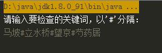
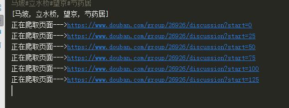
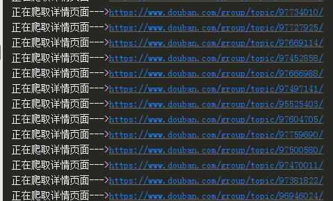
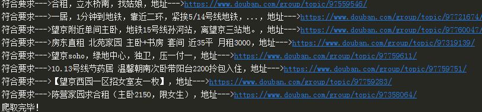
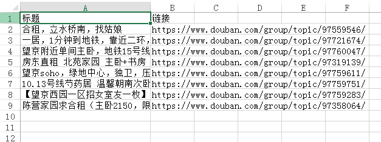

大体思路是首先初始化租房列表页面的url列表，然后爬取每个列表页面，过滤title，如果title不包含关键词，则记录详情页面的超链接，全部租房列表页面访问完毕后，开多线程访问详情页面，爬取内容，查看内容是否包含关键词。
第一步要做的是将要爬取的租房列表页url加入列表，使用chrome查看网页上的分页超链接，如下：

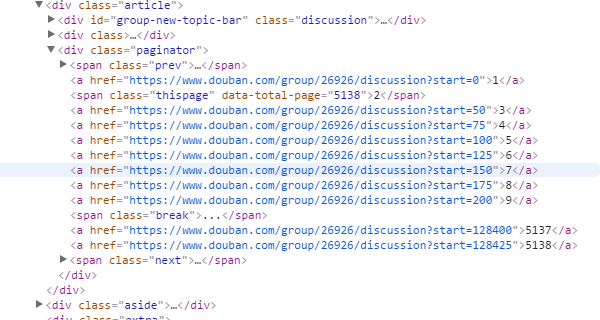

可以看到每页信息的地址为：

    https://www.douban.com/group/26926/discussion?start=0

其中参数start，从0开始，每次递增25。
因此，初始化时，将要爬取的url加入一个队列：

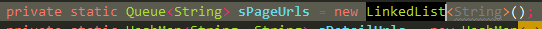

初始化时，从start为0开始初始化，为了保证最新发布的消息在前面，使用队列存储。
之后，开始访问每个列表页面，爬取上面的租房链接信息，优先查看本身超链接的title，如果包含需要搜索的关键字，则不用再去详情页爬取详细内容，直接加入结果列表。列表页中租房信息超链接信息如下：

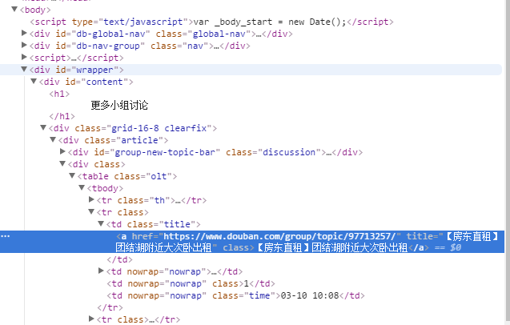

由于Jsoup并不支持xpath，支持使用select选择器获取元素，我们首先获取全部“class=title”的td节点，然后遍历每个td节点，取出其中“a”超链接的标题和链接（"href"）信息，示例代码如下：

    String html = StringUtil.responseToString(response);
            Document document = Jsoup.parse(html);
            //获取class=title的td戒牒
            Elements elements = document.select("td[class=title]");
            if (elements != null && elements.size() > 0) {
                for (Element element : elements) {
                    //获取其中的超链接信息
                    Elements aElements = element.getElementsByTag("a");
                    String title = aElements.text();
                    String href = aElements.attr("href");
                    String detailUrl = UrlUtil.getAbsoluteUrl(pageUrl, href);
                    if (checkString(title) && !sCheckedRes.containsValue(detailUrl)) {
                        sCheckedRes.put(title, detailUrl);
                    } else {
                        if (!sDetailUrls.containsValue(detailUrl) && !sVisitedUrls.contains(detailUrl)) {
                            sDetailUrls.put(title, detailUrl);
                        }
                    }
                }
            }

检查title信息，如果包含需要搜索的关键词，则直接加入结果列表，如果title不包含关键词，则将详情页面的超链接加入url列表。
全部租房列表页面爬取完毕后，得到详情页的url列表，开启多线程爬取详情页面，使用jsoup的选择语法来获取详细描述信息，使用chrome查看租房详细描述信息如下：

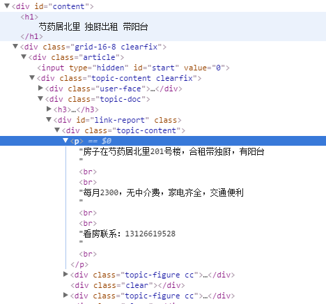

位于“class=topic-content”的div节点下的p节点下，因此可以使用"div[class=topic-content] > p"来获取信息，示例代码如下：

     private static void visitedDetailUrl(String title, String detailUrl) {
        System.out.println("正在爬取详情页面--->" + detailUrl);
        sVisitedUrls.add(detailUrl);
        Response response = NetClient.doGet(detailUrl);
        if (response != null && response.isSuccessful()) {
            String html = StringUtil.responseToString(response);
            Document document = Jsoup.parse(html);
            Elements elements = document.select("div[class=topic-content] > p");
            String content = elements.text();
            if (checkString(content) && !sCheckedRes.containsValue(detailUrl)) {
                sCheckedRes.put(title, detailUrl);
            }
        }
        response.body().close();
    }

####注意的问题
1、豆瓣机器人验证问题
在爬取豆瓣小组的过程中，频繁的爬取会造成服务器返回403错误，可以休眠一段时间后继续爬取。
有时，爬取速度过快，豆瓣会认为是机器人，从而跳转到如下页面：

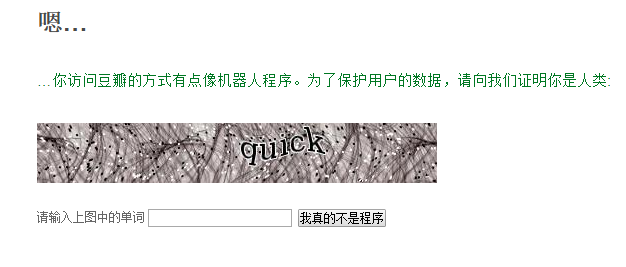

使用chrome查看信息如下：

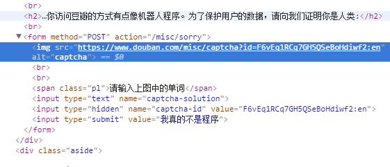

手动提交验证码后，使用chrome或者fiddler抓包可以看到发起了一个post请求，提交的信息如下：

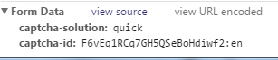

其中，"captcha-solution"为验证码的值，"captcha-id"为前一个页面中的隐藏的"captcha-id"的值，识别验证码可以采用开源的识别方案，这里，为了简便，我们下载验证码后，使用系统自带的图片查看器显示图片，让用户手动输入验证码。使用select选择器获取验证码链接和"captcha-id"，验证码链接位于"alt=captcha"的img中，"captcha-id"位于"name=captcha-id"的input中,示例代码如下：

    private static void processRobotCheckPage() {
        String checkUrl = "https://www.douban.com/misc/sorry";
        System.out.println("处理异常情况--->" + checkUrl);
        Response response = NetClient.doGet(checkUrl);
        if (response != null) {
            String html = StringUtil.responseToString(response);
            Document document = Jsoup.parse(html);
            Elements img = document.select("img[alt=captcha]");
            String src = img.attr("src");
            String id = document.select("input[name=captcha-id]").attr("value");
            HashMap<String, String> params = new HashMap<String, String>();
            // params.put( "ck", "5txN" );
            Response imgResponse = NetClient.doGet(src);
            if (imgResponse != null && imgResponse.isSuccessful()) {
                FileUtil.saveInputStreamToFile(CAPTCHA_PATH, imgResponse.body().byteStream());
            }
            ImageUtil.showPic(CAPTCHA_PATH);
            System.out.println("请输入图形验证码：");
            String code = sScanner.next();
            params.put("captcha-id", id);
            params.put("captcha-solution", code);
            Response checkResponse = NetClient.doPost(checkUrl, params);
            if (checkResponse != null && 403 != checkResponse.code()) {
                System.out.println("验证成功！");
            } else {
                System.out.println("验证失败--->" + checkResponse.code());
            }
            response.body().close();
            imgResponse.body().close();
        }
    }

2、防止重复爬取URL
在此爬取过程中不会出现url重复，造成重复爬取循环的问题，避免这种问题的做法是，将每个爬取过的url加入一个列表，爬取页面发现新的超链接时，首先判断该链接是否被访问过。
3、为了正常品爬取网页，需要加入一些头部信息：

       private static HashMap<String, String> genDefaultPcHeaders() {
        HashMap<String, String> headers = new HashMap<String, String>();
        headers.put("Connection", "keep-alive");
        headers.put("Accept", "*/*");
        headers.put("User-Agent",
                "Mozilla/5.0 (Windows NT 6.1; Win64; x64) AppleWebKit/537.36 (KHTML, like Gecko) Chrome/54.0.2840.99 Safari/537.36");
        headers.put("Content-Type", "application/x-www-form-urlencoded; charset=UTF-8");
        headers.put("Accept-Encoding", "gzip, deflate, br");
        headers.put("Accept-Language", "zh-CN,zh;q=0.8");
        return headers;
    }

4、由于头部信息中，加入了"Accept-Encoding : gzip,defate,br"，导致接收到的response进行了gzip压缩，可以使用GZIPInputStream转换成正常的InputStream：

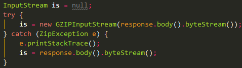

全部示例代码如下：
<a href='Douban.java'>示例代码</a>
