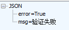

&nbsp;&nbsp;&nbsp;&nbsp;&nbsp;&nbsp;&nbsp;&nbsp;本文主要讲述了如何爬取链家房源信息，并使用MySql持久化存储信息，同时，分析了链家的登录、处理验证码等过程。
&nbsp;&nbsp;&nbsp;&nbsp;&nbsp;&nbsp;&nbsp;&nbsp;爬取的整个流程如下：
 

#####链家登录
&nbsp;&nbsp;&nbsp;&nbsp;&nbsp;&nbsp;&nbsp;&nbsp;通过Fiddler抓包可以看到，PC网页版链接登录时，会发起两个请求：
 

&nbsp;&nbsp;&nbsp;&nbsp;&nbsp;&nbsp;&nbsp;&nbsp;第一个请求为get请求，请求这个地址时，会获取到json数据
 

&nbsp;&nbsp;&nbsp;&nbsp;&nbsp;&nbsp;&nbsp;&nbsp;解析其中的"data"，在登录时会用到。
 
&nbsp;&nbsp;&nbsp;&nbsp;&nbsp;&nbsp;&nbsp;&nbsp;第二个请求为post请求，为登录请求，请求post发送的数据为：
 

 
&nbsp;&nbsp;&nbsp;&nbsp;&nbsp;&nbsp;&nbsp;&nbsp;其中的lt即为第一个请求获取到的data，可以看到，密码采用明文传输,登陆的返回值如下：
 

 
&nbsp;&nbsp;&nbsp;&nbsp;&nbsp;&nbsp;&nbsp;&nbsp;通过判断"success"是否等于1来判断是否登录成功。

#####获取房源信息的URL
&nbsp;&nbsp;&nbsp;&nbsp;&nbsp;&nbsp;&nbsp;&nbsp;链家二手房源的url的构成为：
http://bj.lianjia.com/ershoufang/ + 区域名称 + /pg + 页数
 
&nbsp;&nbsp;&nbsp;&nbsp;&nbsp;&nbsp;&nbsp;&nbsp;区域名称为各区对应的汉语拼音。

    public static final String[] DISTRICTS = {"dongcheng", "xicheng", "haidian", "fengtai", "shijingshan", "tongzhou"
            , "changping", "daxing", "yizhuangkaifaqu", "shunyi", "fangshan", "mentougou", "pingu", "huairou"
            , "miyun", "yanqing", "yanjiao"};    

&nbsp;&nbsp;&nbsp;&nbsp;&nbsp;&nbsp;&nbsp;&nbsp;其中的页数，可以去访问各个区域的第一页获取:
 

 

 
&nbsp;&nbsp;&nbsp;&nbsp;&nbsp;&nbsp;&nbsp;&nbsp;总的页数位于"class=page-box house-list-page-box"的div节点的"page-data"属性，是一个json，解析其中的"totalPage"即可获取当前区域的总页数，构造出当前区域的所有URL。

#####爬取房源信息
&nbsp;&nbsp;&nbsp;&nbsp;&nbsp;&nbsp;&nbsp;&nbsp;访问房源链接，房源信息如下：

 
&nbsp;&nbsp;&nbsp;&nbsp;&nbsp;&nbsp;&nbsp;&nbsp;需要获取的房源信息主要为标题、位置信息、房屋描述信息、小区名称、单价、总价、标签（满五唯一）等，构造bean如下：
    
    public class HouseBean {
    //详细url
    private String detailUrl;
    //总价
    private float totalPrice;
    //单价
    private float unitPrice;
    //标签 例如满五唯一
    private String tag;
    //房屋信息  | 2室1厅 | 101.77平米 | 南 北 | 简装 | 有电梯
    private String description;
    //位置信息
    private String positionInfo;
    //小区
    private String community;
    //面积
    private float area;
    //标题
    private String title;
    //区域
    private String district;
    ......
    }

&nbsp;&nbsp;&nbsp;&nbsp;&nbsp;&nbsp;&nbsp;&nbsp;使用chrome查看网页的源码，可以看到房源的详细信息位于"class=clear"的div下：
 

 
&nbsp;&nbsp;&nbsp;&nbsp;&nbsp;&nbsp;&nbsp;&nbsp;使用Jsoup的选择器获取详细的节点，例如获取小区名称，"class=houseInfo"的div节点下的直接"a"节点的内容即为小区名称：
 

 
&nbsp;&nbsp;&nbsp;&nbsp;&nbsp;&nbsp;&nbsp;&nbsp;因此，select路径可以写为： 
    
    element.select("div[class=houseInfo] > a").first().text()

&nbsp;&nbsp;&nbsp;&nbsp;&nbsp;&nbsp;&nbsp;&nbsp;整个房源信息的解析如下：

    private static HouseBean getHouseBean(Element element, String url) {
        if (element != null) {
            HouseBean houseBean = new HouseBean();
            String title = element.select("div[class=title] > a").first().text();
            houseBean.setTitle(title);
            houseBean.setDetailUrl(element.select("div[class=title] > a").first().attr("href"));
            houseBean.setTotalPrice(Float.valueOf(element.select("div[class=totalPrice] > span").first().text()));
            String unitPriceStr = element.select("div[class=unitPrice] > span").first().text();
            houseBean.setUnitPrice(Float.valueOf(unitPriceStr.substring(unitPriceStr.indexOf("价") + 1, unitPriceStr.indexOf("元"))));
            houseBean.setDescription(element.select("div[class=houseInfo]").first().text());
            houseBean.setArea(CommonUtil.getAreaFromDescription(houseBean.getDescription()));
            houseBean.setCommunity(element.select("div[class=houseInfo] > a").first().text());
            houseBean.setPositionInfo(element.select("div[class=positionInfo]").text());
            houseBean.setTag(element.select("div[class=tag]").first().text());
            houseBean.setDistict(CommonUtil.getDistrictFromUrl(url));
            return houseBean;
        }
        return null;
    }

&nbsp;&nbsp;&nbsp;&nbsp;&nbsp;&nbsp;&nbsp;&nbsp;为了保证爬取速度，使用多线程来爬取详细的房源信息，使用线程池，将所有的链接加入线程池，之后，调用线程池的"shutdown"的方法停止接收新的任务，每隔一段时间检查一下任务是否执行完毕。
     
     for (final String url : sUrls) {
            ThreadPoolManger.getInstance()
                    .execute(() -> getDetailInfo(url));
    }

&nbsp;&nbsp;&nbsp;&nbsp;&nbsp;&nbsp;&nbsp;&nbsp;等待所有线程执行完毕：

    public void await(int unitTime, int checkTimes) {
        // 执行一次，不再接收新的任务，继续执行之前的任务
        ThreadPoolManger.getInstance().getThreadPool().shutdown();
        try {
            while (!ThreadPoolManger.getInstance().getThreadPool().awaitTermination(unitTime, TimeUnit.SECONDS) && checkTimes < 100) {
                // 每隔一定时间检查一次线程是否执行完毕
                System.out.println("尚未全部爬取完毕！");
                checkTimes++;
            }
        } catch (InterruptedException e) {
            // TODO Auto-generated catch block
            ThreadPoolManger.getInstance().getThreadPool().shutdownNow();
            e.printStackTrace();
        }
        ThreadPoolManger.getInstance().getThreadPool().shutdownNow();
    }

&nbsp;&nbsp;&nbsp;&nbsp;&nbsp;&nbsp;&nbsp;&nbsp;最终爬取到了17712条数据，链家首页显示的总共有24253套房源。

#####MySql持久化存储
&nbsp;&nbsp;&nbsp;&nbsp;&nbsp;&nbsp;&nbsp;&nbsp;借助Spring对JDBC的支持，将爬取到的链接以及房源信息存储到数据库，如下图：

#####网络客户端
&nbsp;&nbsp;&nbsp;&nbsp;&nbsp;&nbsp;&nbsp;&nbsp;网络客户端使用的是HttpClient 4.5.3，在构造HttpRequst的时候，加入浏览器的头部信息，

    private static HashMap<String, String> genDefaultPcHeaders() {
        HashMap<String, String> headers = new HashMap<String, String>();
        headers.put("Connection", "keep-alive");
        headers.put("Accept", "*/*");
        headers.put("User-Agent",
                "Mozilla/5.0 (Windows NT 6.1; Win64; x64) AppleWebKit/537.36 (KHTML, like Gecko) Chrome/54.0.2840.99 Safari/537.36");
        headers.put("Content-Type", "application/x-www-form-urlencoded; charset=UTF-8");
        headers.put("Accept-Encoding", "gzip, deflate, br");
        headers.put("Accept-Language", "zh-CN,zh;q=0.8");
        return headers;
    }

    private static void addHeaders(HttpRequest request, Map<String, String> headers) {
        if (headers == null || request == null || headers.size() == 0) {
            return;
        }
        Set<Map.Entry<String, String>> set = headers.entrySet();
        Iterator<Map.Entry<String, String>> iterator = set.iterator();
        for (; iterator.hasNext(); ) {
            Map.Entry<String, String> entry = iterator.next();
            request.addHeader(entry.getKey(), entry.getValue());
        }
    }
&nbsp;&nbsp;&nbsp;&nbsp;&nbsp;&nbsp;&nbsp;&nbsp;在Https处理方面，忽略所有的Https证书，方法如下：
1、实现"javax.net.ssl.X509TrustManager"接口：
    
    package com.wz.common.network;
    import javax.net.ssl.X509TrustManager;
    import java.security.cert.CertificateException;
    import java.security.cert.X509Certificate;
    public class X509TrustManagerImpl implements X509TrustManager {
        public void checkClientTrusted(X509Certificate[] certificates, String authType) throws CertificateException {
            // TODO Auto-generated method stub
        }
        public void checkServerTrusted(X509Certificate[] certificates, String authType) throws CertificateException {
        // TODO Auto-generated method stub
    }
        public X509Certificate[] getAcceptedIssuers() {
            // TODO Auto-generated method stub
            X509Certificate[] certificates = new X509Certificate[]{};
            return certificates;
        }
    }

注意，在"getAcceptedIssuers()"方法中，需要返回一个空的"X509Certificate"数组，而不是直接返回null，直接返回null在请求https时，会发生异常。
2、实现"HostnameVerifier"接口，直接返回"true"
3、在构造HttpClient实例时，将他们关联：

    HttpClientBuilder builder = HttpClients.custom();
        //HTTPS设置
        SSLContext sslContext = null;
        try {
            sslContext = SSLContext.getInstance("TLS");
            TrustManager tm = new X509TrustManagerImpl();
            sslContext.init(null, new TrustManager[]{tm}, new java.security.SecureRandom());
            builder.setSSLContext(sslContext);
        } catch (NoSuchAlgorithmException e) {
            e.printStackTrace();
        } catch (KeyManagementException e) {
            e.printStackTrace();
        }
        builder.setSSLHostnameVerifier(new HostnameVerifierImpl());

&nbsp;&nbsp;&nbsp;&nbsp;&nbsp;&nbsp;&nbsp;&nbsp;在Cookie方面，HttpClient会在请求时，自动带上Cookie，完成会话保持。

#####链家爬虫异常处理
&nbsp;&nbsp;&nbsp;&nbsp;&nbsp;&nbsp;&nbsp;&nbsp;当爬取过于频繁时，链家会将当前地址重定向到
"http://captcha.lianjia.com?redirect=当前地址"
，如下图：

&nbsp;&nbsp;&nbsp;&nbsp;&nbsp;&nbsp;&nbsp;&nbsp;开始时，怎么也无法获取到"302"的Http返回码，HttpClient直接跳转到了验证码页面，返回"200"，查阅资料发现，在HttpClient的设置中：

    private static RequestConfig genRequestConfig() {
        RequestConfig.Builder builder = RequestConfig.custom();
        builder.setConnectionRequestTimeout(CONNECTION_REQUEST_TIMEOUT)
                .setConnectTimeout(CONNECT_TIMEOUT)
                .setSocketTimeout(SOCKET_TIMEOUT);
        builder.setCookieSpec(CookieSpecs.STANDARD);
        builder.setCircularRedirectsAllowed(true);
        builder.setRedirectsEnabled(false);
        return builder.build();
    }

&nbsp;&nbsp;&nbsp;&nbsp;&nbsp;&nbsp;&nbsp;&nbsp;其中的"setRedirectsEnabled(bolean redirectsEnabled)"需要设置为false，不然HttpClient会直接跳转到重定向的地址，无法通过返回码判断是否重定向到了验证码页面。
 
&nbsp;&nbsp;&nbsp;&nbsp;&nbsp;&nbsp;&nbsp;&nbsp;使用Fiddler抓包可以发现，在访问验证码页面的同时，链家网页会同时请求<a href="http://captcha.lianjia.com/human">http://captcha.lianjia.com/human</a>获取验证码的一些信息，链家的验证码是展示四个图片，选择倒置的图片，这里的处理策略是获取图片信息，展示出来，识别出倒置图片的序号，获取的验证码信息如下：

&nbsp;&nbsp;&nbsp;&nbsp;&nbsp;&nbsp;&nbsp;&nbsp;其中，images为四张验证码图片，为图片base64编码之后的信息，uuid在之后的验证请求中会用到。
&nbsp;&nbsp;&nbsp;&nbsp;&nbsp;&nbsp;&nbsp;&nbsp;通过Fiddler抓包可以看到，验证请求采用的post请求，请求的地址为"http://captcha.lianjia.com/human"，请求的数据如下图：

&nbsp;&nbsp;&nbsp;&nbsp;&nbsp;&nbsp;&nbsp;&nbsp;其中，uuid为刚才请求验证码信息中的uuid，_csrf为网页中隐藏的信息，查看源码：

&nbsp;&nbsp;&nbsp;&nbsp;&nbsp;&nbsp;&nbsp;&nbsp;此信息位于"name=_csrf"的input下，并且属性设置为隐藏。bitvalue为选择的图片序号，4张图片上往下，从左往右依次是"1,2,4,8"，排列顺序也是上图json中的从上到下的顺序。post请求的结果如下：
 
&nbsp;&nbsp;&nbsp;&nbsp;&nbsp;&nbsp;&nbsp;&nbsp;失败结果：
 

 
&nbsp;&nbsp;&nbsp;&nbsp;&nbsp;&nbsp;&nbsp;&nbsp;成功结果：
 

 
&nbsp;&nbsp;&nbsp;&nbsp;&nbsp;&nbsp;&nbsp;&nbsp;项目源码位于：
<a href="https://github.com/WangZzzz/WSpider">源代码</a>
 
&nbsp;&nbsp;&nbsp;&nbsp;&nbsp;&nbsp;&nbsp;&nbsp;爬取到的房源信息，导出excel：
<a href="house_info.xlsx">房源信息汇总</a>

