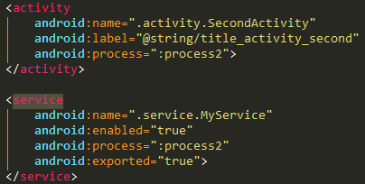
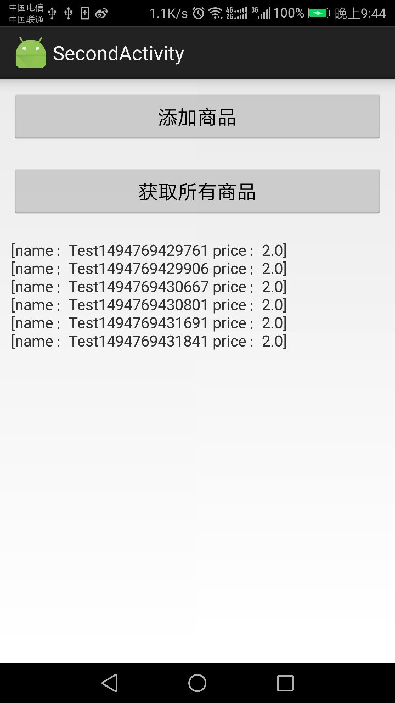

### Android AIDL学习及使用
&nbsp;&nbsp;&nbsp;&nbsp;&nbsp;&nbsp;&nbsp;&nbsp;Android中不同进程之间的内存空间各自独立，无法互相访问，AIDL（Android Interface Definition Language，Android接口定义语言）作为Android的IPC（进程间通信）的一种解决方案，很好的解决了不同进程或者不同应用之间的信息传递和数据互访的问题。

&nbsp;&nbsp;&nbsp;&nbsp;&nbsp;&nbsp;&nbsp;&nbsp;首先，我们来看一下线程和进程的概念：

*线程：线程Thread是cpu调度的基本单位，它是比进程更小的能独立运行的基本单位.线程自己基本上不拥有系统资源，只拥有一点在运行中必不可少的资源(如程序计数器， 一组寄存器和栈)， 但是它可与同属一个进程的其他的线程共享进程所拥有的全部资源。*

*进程：进程是具有一定独立功能的程序,Android的底层是liunx内核，Android中进程即为Linux中的一个进程。*

&nbsp;&nbsp;&nbsp;&nbsp;&nbsp;&nbsp;&nbsp;&nbsp;Android中实现多进程，需要在AndroidManifest.xml的四大组件的节点下加入process标签，指定运行的进程。如下图所示：
 

&nbsp;&nbsp;&nbsp;&nbsp;&nbsp;&nbsp;&nbsp;&nbsp;AIDL的使用步骤如下：

&nbsp;&nbsp;&nbsp;&nbsp;&nbsp;&nbsp;&nbsp;&nbsp;假设使用场景为客户端需要从服务端获取商品信息，同时可以添加商品到服务端，开发环境为Android Studio 2.3.1。

&nbsp;&nbsp;&nbsp;&nbsp;&nbsp;&nbsp;&nbsp;&nbsp;服务端：

&nbsp;&nbsp;&nbsp;&nbsp;&nbsp;&nbsp;&nbsp;&nbsp;1、新建商品Product类，需要实现Parcelable接口如下：

	package com.wz.query.aidl;

	import android.os.Parcel;
	import android.os.Parcelable;

	public class Product implements Parcelable {
	    float price;
	    String name;

	    public float getPrice() {
	        return price;
	    }

	    public void setPrice(float price) {
	        this.price = price;
	    }

	    public String getName() {
	        return name;
	    }

	    public void setName(String name) {
	        this.name = name;
	    }

	    @Override
	    public int describeContents() {
	        return 0;
	    }

	    @Override
	    public void writeToParcel(Parcel dest, int flags) {
	        dest.writeFloat(this.price);
	        dest.writeString(this.name);
	    }

	    public Product() {
	    }

	    protected Product(Parcel in) {
	        this.price = in.readFloat();
	        this.name = in.readString();
	    }

	    public static final Parcelable.Creator<Product> CREATOR = new Parcelable.Creator<Product>() {
	        @Override
	        public Product createFromParcel(Parcel source) {
	            return new Product(source);
	        }

	        @Override
	        public Product[] newArray(int size) {
	            return new Product[size];
	        }
	    };

	    @Override
	    public String toString() {
	        return "[name：" + name + " price：" + price + "]";
	    }
	}

&nbsp;&nbsp;&nbsp;&nbsp;&nbsp;&nbsp;&nbsp;&nbsp;2、新建AIDL文件，IProductManager.aidl如下，定义添加商品和获取所有商品的方法：
		
	// IProductManager.aidl
	package com.wz.query.aidl;

	import com.wz.query.aidl.Product;
	// Declare any non-default types here with import statements

	interface IProductManager {

	    List<Product> getProductList();

	    void addProduct(in Product product);
	}

同时，由于需要使用自定义的Product类，因此需要新建Product.aidl来声明，在Product中需要声明Product为parcelable类型：

	// IBook.aidl
	package com.wz.query.aidl;
	// Declare any non-default types here with import statements

	parcelable Product;

&nbsp;&nbsp;&nbsp;&nbsp;&nbsp;&nbsp;&nbsp;&nbsp;在AIDL中所有的参数都需要标注参数方向, in表示该参数为输入类型, out表示输出类型, inout表示输入输出类型. out与inout的开销较大。AIDL支持所有的基本数据类型、String、CharSequence、List（只支持ArrayList）、Map（只支持HashMap）、Parcelable（所有实现了Parcelable接口的对象）、AIDL接口本身，AIDL在使用实现了Parcelable接口的类时，需要显式的导入，例如本例中的IProductManager.aidl中的：

	import com.wz.query.aidl.Product;

&nbsp;&nbsp;&nbsp;&nbsp;&nbsp;&nbsp;&nbsp;&nbsp;3、完成AIDL文件编写后，在Android Studio中编译一下项目，会自动生成IProductManager.java文件：
	
	/*
	 * This file is auto-generated.  DO NOT MODIFY.
	 * Original file: D:\\java\\android\\workspace\\TestWorkspace\\QueryInOne\\app\\src\\main\\aidl\\com\\wz\\query\\aidl\\IProductManager.aidl
	 */
	package com.wz.query.aidl;
	// Declare any non-default types here with import statements

	public interface IProductManager extends android.os.IInterface {
	    /**
	     * Local-side IPC implementation stub class.
	     */
	    public static abstract class Stub extends android.os.Binder implements com.wz.query.aidl.IProductManager {
	        private static final java.lang.String DESCRIPTOR = "com.wz.query.aidl.IProductManager";

	        /**
	         * Construct the stub at attach it to the interface.
	         */
	        public Stub() {
	            this.attachInterface(this, DESCRIPTOR);
	        }

	        /**
	         * Cast an IBinder object into an com.wz.query.aidl.IProductManager interface,
	         * generating a proxy if needed.
	         */
	        public static com.wz.query.aidl.IProductManager asInterface(android.os.IBinder obj) {
	            if ((obj == null)) {
	                return null;
	            }
	            android.os.IInterface iin = obj.queryLocalInterface(DESCRIPTOR);
	            if (((iin != null) && (iin instanceof com.wz.query.aidl.IProductManager))) {
	                return ((com.wz.query.aidl.IProductManager) iin);
	            }
	            return new com.wz.query.aidl.IProductManager.Stub.Proxy(obj);
	        }

	        @Override
	        public android.os.IBinder asBinder() {
	            return this;
	        }

	        @Override
	        public boolean onTransact(int code, android.os.Parcel data, android.os.Parcel reply, int flags) throws android.os.RemoteException {
	            switch (code) {
	                case INTERFACE_TRANSACTION: {
	                    reply.writeString(DESCRIPTOR);
	                    return true;
	                }
	                case TRANSACTION_getProductList: {
	                    data.enforceInterface(DESCRIPTOR);
	                    java.util.List<com.wz.query.aidl.Product> _result = this.getProductList();
	                    reply.writeNoException();
	                    reply.writeTypedList(_result);
	                    return true;
	                }
	                case TRANSACTION_addProduct: {
	                    data.enforceInterface(DESCRIPTOR);
	                    com.wz.query.aidl.Product _arg0;
	                    if ((0 != data.readInt())) {
	                        _arg0 = com.wz.query.aidl.Product.CREATOR.createFromParcel(data);
	                    } else {
	                        _arg0 = null;
	                    }
	                    this.addProduct(_arg0);
	                    reply.writeNoException();
	                    return true;
	                }
	            }
	            return super.onTransact(code, data, reply, flags);
	        }

	        private static class Proxy implements com.wz.query.aidl.IProductManager {
	            private android.os.IBinder mRemote;

	            Proxy(android.os.IBinder remote) {
	                mRemote = remote;
	            }

	            @Override
	            public android.os.IBinder asBinder() {
	                return mRemote;
	            }

	            public java.lang.String getInterfaceDescriptor() {
	                return DESCRIPTOR;
	            }

	            @Override
	            public java.util.List<com.wz.query.aidl.Product> getProductList() throws android.os.RemoteException {
	                android.os.Parcel _data = android.os.Parcel.obtain();
	                android.os.Parcel _reply = android.os.Parcel.obtain();
	                java.util.List<com.wz.query.aidl.Product> _result;
	                try {
	                    _data.writeInterfaceToken(DESCRIPTOR);
	                    mRemote.transact(Stub.TRANSACTION_getProductList, _data, _reply, 0);
	                    _reply.readException();
	                    _result = _reply.createTypedArrayList(com.wz.query.aidl.Product.CREATOR);
	                } finally {
	                    _reply.recycle();
	                    _data.recycle();
	                }
	                return _result;
	            }

	            @Override
	            public void addProduct(com.wz.query.aidl.Product product) throws android.os.RemoteException {
	                android.os.Parcel _data = android.os.Parcel.obtain();
	                android.os.Parcel _reply = android.os.Parcel.obtain();
	                try {
	                    _data.writeInterfaceToken(DESCRIPTOR);
	                    if ((product != null)) {
	                        _data.writeInt(1);
	                        product.writeToParcel(_data, 0);
	                    } else {
	                        _data.writeInt(0);
	                    }
	                    mRemote.transact(Stub.TRANSACTION_addProduct, _data, _reply, 0);
	                    _reply.readException();
	                } finally {
	                    _reply.recycle();
	                    _data.recycle();
	                }
	            }
	        }

	        static final int TRANSACTION_getProductList = (android.os.IBinder.FIRST_CALL_TRANSACTION + 0);
	        static final int TRANSACTION_addProduct = (android.os.IBinder.FIRST_CALL_TRANSACTION + 1);
	    }

	    public java.util.List<com.wz.query.aidl.Product> getProductList() throws android.os.RemoteException;

	    public void addProduct(com.wz.query.aidl.Product product) throws android.os.RemoteException;
	}

&nbsp;&nbsp;&nbsp;&nbsp;&nbsp;&nbsp;&nbsp;&nbsp;4、创建ProductService，实现IProductManager的Stub类：

	package com.wz.query.service;

	import android.app.Service;
	import android.content.Intent;
	import android.os.Binder;
	import android.os.IBinder;
	import android.os.RemoteException;

	import com.wz.query.aidl.IProductManager;
	import com.wz.query.aidl.Product;

	import java.util.ArrayList;
	import java.util.List;

	public class ProductService extends Service {

	    private List<Product> mProducts = new ArrayList<>();

	    private Binder mBinder = new IProductManager.Stub() {

	        @Override
	        public List<Product> getProductList() throws RemoteException {
	            return mProducts;
	        }

	        @Override
	        public void addProduct(Product product) throws RemoteException {
	            if (product != null) {
	                mProducts.add(product);
	            }
	        }
	    };

	    public ProductService() {
	    }

	    @Override
	    public IBinder onBind(Intent intent) {
	        // TODO: Return the communication channel to the service.
	        return mBinder;
	    }
	}

&nbsp;&nbsp;&nbsp;&nbsp;&nbsp;&nbsp;&nbsp;&nbsp;客户端：

&nbsp;&nbsp;&nbsp;&nbsp;&nbsp;&nbsp;&nbsp;&nbsp;1、绑定ProductService

&nbsp;&nbsp;&nbsp;&nbsp;&nbsp;&nbsp;&nbsp;&nbsp;2、在ServiceConnection的onServiceConnected方法中，获取IProductManager。

&nbsp;&nbsp;&nbsp;&nbsp;&nbsp;&nbsp;&nbsp;&nbsp;3、调用IProductManager的addProduct和getProductList方法。

&nbsp;&nbsp;&nbsp;&nbsp;&nbsp;&nbsp;&nbsp;&nbsp;客户端的实现如下：

	package com.wz.query.activity;

	import android.app.Activity;
	import android.content.ComponentName;
	import android.content.Context;
	import android.content.Intent;
	import android.content.ServiceConnection;
	import android.os.Bundle;
	import android.os.IBinder;
	import android.os.RemoteException;
	import android.view.View;
	import android.widget.TextView;

	import com.wz.query.R;
	import com.wz.query.aidl.IProductManager;
	import com.wz.query.aidl.Product;
	import com.wz.query.service.ProductService;

	import java.util.List;

	import butterknife.BindView;
	import butterknife.ButterKnife;

	public class SecondActivity extends Activity {

	    @BindView(R.id.textView)
	    TextView mTextView;

	    private IProductManager mProductManager;

	    private ServiceConnection mConnection = new ServiceConnection() {

	        @Override
	        public void onServiceConnected(ComponentName name, IBinder service) {
	            mProductManager = IProductManager.Stub.asInterface(service);
	        }

	        @Override
	        public void onServiceDisconnected(ComponentName name) {

	        }
	    };

	    @Override
	    protected void onCreate(Bundle savedInstanceState) {
	        super.onCreate(savedInstanceState);
	        setContentView(R.layout.activity_second);
	        ButterKnife.bind(this);
	        bindService();
	    }

	    private void bindService() {
	        Intent intent = new Intent(this, ProductService.class);
	        bindService(intent, mConnection, Context.BIND_AUTO_CREATE);
	    }

	    public void addProduct(View view) {
	        Product product = new Product();
	        product.setName("Test" + System.currentTimeMillis());
	        product.setPrice(2.0f);

	        if (mProductManager != null) {
	            try {
	                mProductManager.addProduct(product);
	            } catch (RemoteException e) {
	                e.printStackTrace();
	            }
	        }
	    }

	    public void getProductList(View view) {
	        mTextView.setText("");
	        if (mProductManager != null) {
	            List<Product> productList = null;
	            try {
	                productList = mProductManager.getProductList();
	            } catch (RemoteException e) {
	                e.printStackTrace();
	            }
	            if (productList != null && productList.size() > 0) {
	                for (Product product : productList) {
	                    mTextView.append(product + "\n");
	                }
	            }
	        }
	    }

	    @Override
	    protected void onDestroy() {
	        super.onDestroy();
	        unbindService(mConnection);
	    }

	}

&nbsp;&nbsp;&nbsp;&nbsp;&nbsp;&nbsp;&nbsp;&nbsp;AIDL的原理如下，我们看到自动生成的IProductManager.java中有一个实现IProductManager的Proxy类，从名字可以看出这是一个代理类，这个类运行在客户端中，AIDL中客户端和服务端通过Proxy代理类互相通信，客户端调用的方法实际是调用是Proxy代理中的方法，然后代理Proxy通过和服务端通信将返回的结果返回给客户端。

&nbsp;&nbsp;&nbsp;&nbsp;&nbsp;&nbsp;&nbsp;&nbsp;IProductManager有以下几个变量和方法：

*DESCRIPTION：*

&nbsp;&nbsp;&nbsp;&nbsp;&nbsp;&nbsp;&nbsp;&nbsp;Binderd的唯一标识，一般用当前的类名表示，在本例中为"com.wz.query.aidl.IProductManager"

*asInterface(android.os.IBinder obj）：*

&nbsp;&nbsp;&nbsp;&nbsp;&nbsp;&nbsp;&nbsp;&nbsp;用于将服务端的Binder对象转换为客户端需要的AIDL接口类型的对象，转换区分进程，客户端服务端位于同一进程，返回服务端的Stub对象本身；否则返回的是系统的封装后的Stub.proxy对象。

*asBInder：*

&nbsp;&nbsp;&nbsp;&nbsp;&nbsp;&nbsp;&nbsp;&nbsp;返回Binder对象

*onTransact：*

&nbsp;&nbsp;&nbsp;&nbsp;&nbsp;&nbsp;&nbsp;&nbsp;此方法运行在服务端中的Binder线程池中，当客户端发起跨进程请求时，远程请求会通过系统底层封装后交由此方法处理。

*Proxy#getProductList、addProduct：*

&nbsp;&nbsp;&nbsp;&nbsp;&nbsp;&nbsp;&nbsp;&nbsp;getProductList运行在客户端，当客户端远程调用此方法时，它的内部实现是这样的：首先创建该方法所需要的输入型Parcel对象_data、输出型Parcel对象_reple以及返回值对象_result,然后将该方法的参数信息写入_data中；接着调用transact方法来发RPC请求，同时当前线程挂起；然后服务端的onTransact方法会被调用，直到RPC过程返回后，当前线程继续执行，并从_reply中取出RPC过程返回的结果，写入_result中。addProduct方法同样运行在客户端，它的执行过程和getProductList相同，由于addProduct没有返回值，因此不需要从_reply中取出返回值。_

&nbsp;&nbsp;&nbsp;&nbsp;&nbsp;&nbsp;&nbsp;&nbsp;Messenger同样作为跨进程通信的一种方法，他与AIDL之间的区别如下：

&nbsp;&nbsp;&nbsp;&nbsp;&nbsp;&nbsp;&nbsp;&nbsp;1、Messenger的底层也是由AIDL实现的，对AIDL进行了封装；

&nbsp;&nbsp;&nbsp;&nbsp;&nbsp;&nbsp;&nbsp;&nbsp;2、Messenger不适合处理大量的并发数据，Messenger对Client的请求时单线程的，AIDL是多线程的；

&nbsp;&nbsp;&nbsp;&nbsp;&nbsp;&nbsp;&nbsp;&nbsp;3、调用Client的方法，使用Messenger获取返回值是同步的，使用AIDL获取返回值是异步的；

&nbsp;&nbsp;&nbsp;&nbsp;&nbsp;&nbsp;&nbsp;&nbsp;4、Messenger不适用于跨进程调用服务端的方法。