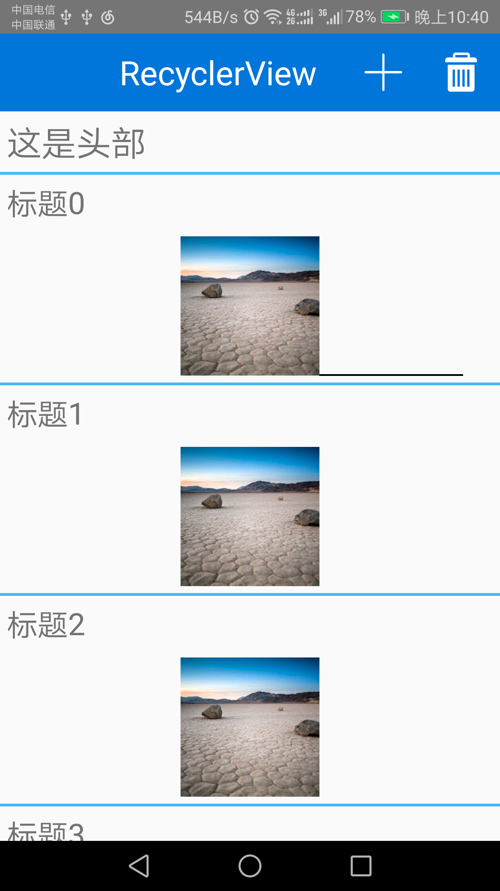
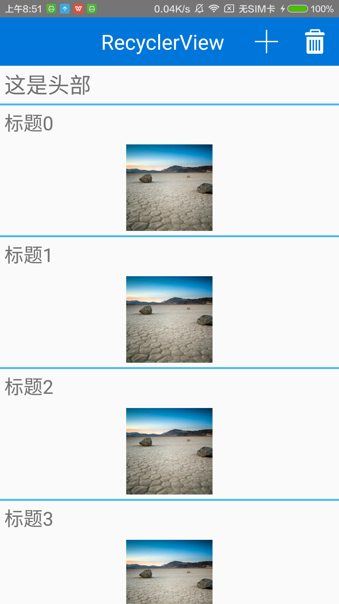
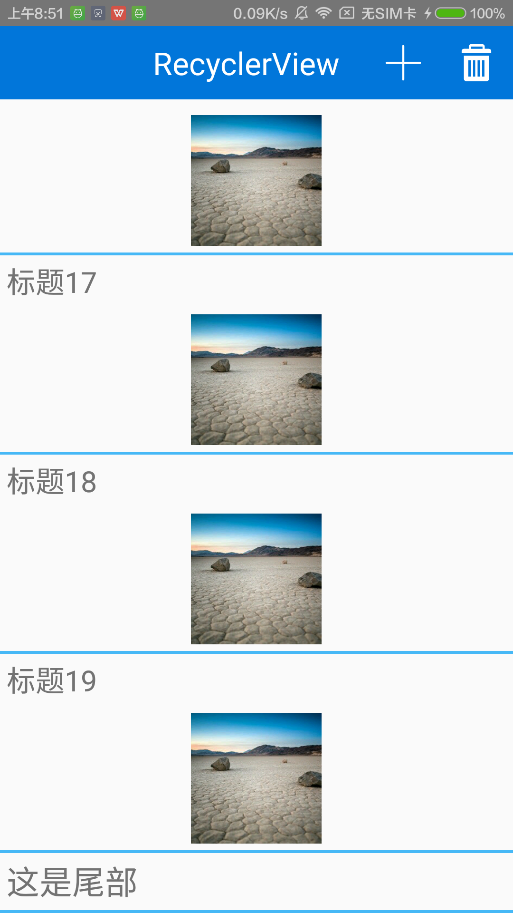
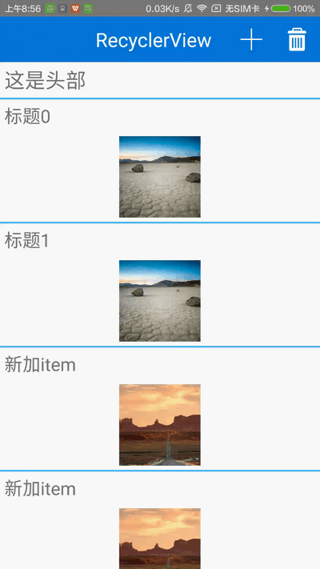

###RecyclerView使用详解
RecyclerView是Google官方推出的用于替代ListView的产品，本身就支持线性布局、网格布局和瀑布流布局等，同时，支持很多新的特性，使用RecyclerView时，必须制定一个适配器（Adapter，继承自RecyclerView.Adapter）和一个布局管理器，具体如下：

#####基本使用
定义Adapter继承自RecyclerView.Adapter，同时，在内部继承自RecyclerView.ViewHolder，复写以下方法：

    public ViewHolder onCreateViewHolder(ViewGroup parent, int viewType);

此方法加载布局，返回自己实现的ViewHolder。

    public void onBindViewHolder(ViewHolder holder, int position);

此方法是在将数据绑定到ViewHolder上。

    public int getItemCount();

此方法返回item数量。
示例代码如下：

    import android.content.Context;
    import android.net.Uri;
    import android.support.v7.widget.RecyclerView;
    import android.view.LayoutInflater;
    import android.view.View;
    import android.view.ViewGroup;
    import android.widget.ImageView;
    import android.widget.TextView;

    import com.bumptech.glide.Glide;
    import com.cmbc.firefly.recyclerviewdemo.R;
    import com.cmbc.firefly.recyclerviewdemo.bean.InfoBean;

    import java.util.List;

    /**
     * RecyclerView适配器
     */
    public class MyAdapter extends RecyclerView.Adapter<MyAdapter.ViewHolder> {

        private List<InfoBean> mInfos;
        private Context mContext;

        public MyAdapter(Context context, List<InfoBean> infos) {
            mInfos = infos;
            mContext = context;
        }

        @Override
        public ViewHolder onCreateViewHolder(ViewGroup parent, int viewType) {
            View view = LayoutInflater.from(mContext).inflate(R.layout.item_layout, parent, false);
            ViewHolder viewHolder = new ViewHolder(view);
            return viewHolder;
        }

        @Override
        public void onBindViewHolder(ViewHolder holder, int position) {
            if (mInfos != null) {
                InfoBean info = mInfos.get(position);
                if (info != null) {
                    holder.mTvTitle.setText(info.getTitle());
                    Glide.with(mContext).load(Uri.parse(info.getImgUrl())).into(holder.mIvImg);
                }
            }
        }

        @Override
        public int getItemCount() {
            return mInfos == null ? 0 : mInfos.size();
        }

        class ViewHolder extends RecyclerView.ViewHolder {
            private TextView mTvTitle;
            private ImageView mIvImg;

            public ViewHolder(View itemView) {
                super(itemView);
                mTvTitle = (TextView) itemView.findViewById(R.id.tv_title);
                mIvImg = (ImageView) itemView.findViewById(R.id.iv_img);
            }
        }

    }

同时，初始化RecyclerView、数据以及Adapter，同时设置RecyclerView的布局管理器，这里，我们使用线性布局：

    import android.app.Activity;
    import android.os.Bundle;
    import android.support.v7.widget.LinearLayoutManager;
    import android.support.v7.widget.RecyclerView;
    import com.cmbc.firefly.recyclerviewdemo.R;
    import com.cmbc.firefly.recyclerviewdemo.adapter.MyAdapter;
    import com.cmbc.firefly.recyclerviewdemo.bean.InfoBean;
    import java.util.ArrayList;
    import java.util.List;
    public class MainActivity extends Activity {
        private RecyclerView mRecyclerView;
        private MyAdapter mAdapter;
        private List<InfoBean> mInfos;
        @Override
        protected void onCreate(Bundle savedInstanceState) {
            super.onCreate(savedInstanceState);
            setContentView(R.layout.activity_main);
            findViewById();
            init();
        }
        private void findViewById() {
            mRecyclerView = (RecyclerView) findViewById(R.id.recyclerView);
        }
        private void init() {
            mInfos = new ArrayList<InfoBean>();
            for (int i = 0; i < 20; i++) {
                InfoBean infoBean = new InfoBean();
                infoBean.setTitle("标题" + i);
                infoBean.setImgUrl("http://img.my.csdn.net/uploads/201407/26/1406383092_3071.jpg");
                mInfos.add(infoBean);
            }
            mAdapter = new MyAdapter(this, mInfos);
            //设置线性布局
            mRecyclerView.setLayoutManager(new LinearLayoutManager(this));
            mRecyclerView.setAdapter(mAdapter);
        }
    }

#####设置分割线
RecyclerView通过：

    public void addItemDecoration(ItemDecoration decor)

方法来设置分割线，ItemDecoration是一个抽象类，需要我们自己去实现它，主要实现以下的两个方法：

    //绘制分割线
    public void onDraw(Canvas c, RecyclerView parent, RecyclerView.State state);
    public void onDrawOver(Canvas c, RecyclerView parent, RecyclerView.State state);
    //设置原item的偏移大小
    public void getItemOffsets(Rect outRect, View view, RecyclerView parent, RecyclerView.State state);

其中，onDraw和onDrawOver方法实现一个即可。
这里以线性布局为例，来说明RecyclerView分割线的实现方法。
在绘制分割线时，需要区分两种情况，垂直的线性布局和水平的线性布局，因为要分别画横线和竖线。我们定义两个常量，在构造ItemDecoration对象时，根据实际的布局，传入方向：

        public static final int HORIZONTAL_LIST = LinearLayoutManager.HORIZONTAL;
        public static final int VERTICAL_LIST = LinearLayoutManager.VERTICAL;

根据不同的线性布局方向来分别水平分割线和垂直分割线，我们编写两个构造方法，一个是使用系统的分割线，另一个是用户传入分割线的图片：

     /**
     * 使用系统的分割线
     *
     * @param context
     * @param orientation
     */
    public MyDecoration(Context context, int orientation) {
        final TypedArray a = context.obtainStyledAttributes(new int[]{android.R.attr.listDivider});
        mDivider = a.getDrawable(0);
        a.recycle();
        setOrientation(orientation);
    }

    /**
     * 自定义分割线
     *
     * @param context
     * @param orientation 列表方向
     * @param drawableId  分割线图片
     */
    public MyDecoration(Context context, int orientation, int drawableId) {
        this(context, orientation);
        mDivider = ContextCompat.getDrawable(context, drawableId);
        mDividerHeight = mDivider.getIntrinsicHeight();
    }

其中通过Drawable的'getIntrinsicHeight()'方法来获取Drawable实际的高度来作为分割线的高度（或者宽度）。
在实际绘制分割线时，通过Drawable的：

        public void setBounds(int left, int top, int right, int bottom);

方法来确定在Canvas的哪个矩形区域内进行绘制Drawable。那么这四个坐标怎么计算呢，我们以绘制垂直先行布局的水平分割线来说明：

     /**
     * 绘制垂直线性布局排列的分割线
     *
     * @param c
     * @param parent
     */
    public void drawVertical(Canvas c, RecyclerView parent) {
        final int left = parent.getPaddingLeft();
        final int right = parent.getWidth() - parent.getPaddingRight();
        final int childCount = parent.getChildCount();
        for (int i = 0; i < childCount; i++) {
            final View child = parent.getChildAt(i);
            RecyclerView v = new RecyclerView(parent.getContext());
            final RecyclerView.LayoutParams params = (RecyclerView.LayoutParams) child.getLayoutParams();
            final int top = child.getBottom() + params.bottomMargin;
            final int bottom = top + mDividerHeight;
            if (mDivider != null) {
                mDivider.setBounds(left, top, right, bottom);
                mDivider.draw(c);
            }
        }
    }

left我们用RecyclerView获取的左边距即为分割线的left；
rigth,为RecyclerView的宽度减去item的右边距；
top,即图中蓝线的位置，为item本身的bottom坐标，再加上item相对于下一个item的距离，也就是item的layout_marginBottom属性（蓝线和黑线之间的距离）；
bottom,即为top再加上分割线本身的高度（宽度）。

由于设置了Divider分割线，分割线本身具有高度（垂直线性布局）和宽度（水平线性布局），因此，原来的item相比于原来的位置有迁移，而迁移的大小为分割线的高度或者宽度：

    @Override
    public void getItemOffsets(Rect outRect, View view, RecyclerView parent, RecyclerView.State state) {
        if (mOrientation == VERTICAL_LIST) {
            //item下边的Y坐标偏移分割线的高度
            outRect.set(0, 0, 0, mDividerHeight);
        } else {
            //item右边的x坐标偏移分割线的宽度
            outRect.set(0, 0, mDividerHeight, 0);
        }
    }

在使用自定义Drawable作为分割线时，需要使用"rectangle"，而不能使用"line"，若分割线有左右偏移量，可以使用"inset"，示例如下：

    <?xml version="1.0" encoding="utf-8"?>
    <inset xmlns:android="http://schemas.android.com/apk/res/android"
           android:insetLeft="15dp">
        <shape
            android:shape="rectangle"
            >
            <solid
                android:color="#eaeaea"/>
            <size android:height="1dp"/>
        </shape>
    </inset>

#####设置头部布局和尾部布局

通过在Adapter中设置item的类型，设置一下三种类型：

    //头部布局
    private static final int TYPE_HEADER = 0;
    //正常item布局
    private static final int TYPE_ITEM = 1;
    //尾部布局
    private static final int TYPE_FOOTER = 2;

Adapter中提供设置头部布局和尾部布局的方法，

	//设置尾部布局
	 public void setFooterView(View view) {
        mFooterView = view;
        mFooterCnt = 1;
    }
    //设置尾部布局
    public void setHeaderView(View view) {
        mHeaderView = view;
        mHeaderCnt = 1;
    }
	

使用mFooterCnt和mHeaderCnt来计数，这样在返回item数量的方法里面可以直接使用：

     @Override
    public int getItemCount() {
        return mInfos == null ? (mFooterCnt + mHeaderCnt) : (mInfos.size() + mFooterCnt + mHeaderCnt);
    }

在Adapter中，复写

    public int getItemViewType(int position){
        if (position == 0 && mHeaderView != null) {
            return TYPE_HEADER;
        } else if (position == (mHeaderCnt + mInfos.size()) && mFooterView != null) {
            return TYPE_FOOTER;
        } else {
            return TYPE_ITEM;
        }
    }

根据不同的位置以及是否有头尾布局来确定item的类型。

在'onCreateViewHolder'，根据不同的viewType，构造ViewHolder时，传入不同的itemView，如下：

    @Override
    public ViewHolder onCreateViewHolder(ViewGroup parent, int viewType) {
        ViewHolder viewHolder = null;
        switch (viewType) {
            case TYPE_ITEM:
                View view = LayoutInflater.from(mContext).inflate(R.layout.item_layout, parent, false);
                viewHolder = new ViewHolder(view, viewType);
                return viewHolder;
            case TYPE_FOOTER:
                viewHolder = new ViewHolder(mFooterView, viewType);
                break;
            case TYPE_HEADER:
                viewHolder = new ViewHolder(mHeaderView, viewType);
                break;
        }
        return viewHolder;
    }

注意，在'onBindViewHolder'绑定数据时，获取从List中获取数据Item对象时，要用当前的position减去头部布局的cnt，即：

    InfoBean info = mInfos.get(position - mHeaderCnt);

#####item点击和长按事件
RecyclerView不像ListView一样，本身提供了item的长按和点击事件，需要自己去实现，首先定义长按和点击事件的回调街口：

    /**
     * RecyclerView使用，点击事件
     */
    public interface OnItemClickListener {
        void onItemClick(View view, int position);
    }

    /**
     * RecyclerView使用，长按事件
     */
    public interface OnItemLongClickListener {
        boolean onItemLongClick(View view, int position);
    }

然后在Adapter中增加设置点击和长按事件的方法：

    public void setOnItemLongClickListener(OnItemLongClickListener onItemLongClickListener) {
        mOnItemLongClickListener = onItemLongClickListener;
    }

    public void setOnItemClickListener(OnItemClickListener onItemClickListener) {
        mOnItemClickListener = onItemClickListener;
    }

在"onBindViewHolder"中，数据绑定时，设置ItemView的长按或者点击事件，在事件中回调我们自定义接口的长按或者点击回调：

    holder.itemView.setOnClickListener(new View.OnClickListener() {
                    @Override
                    public void onClick(View v) {
                        if (mOnItemClickListener != null) {
                            mOnItemClickListener.onItemClick(holder.itemView, position);
                        }
                    }
                });
    holder.itemView.setOnLongClickListener(new View.OnLongClickListener() {
                    @Override
                    public boolean onLongClick(View v) {
                        if (mOnItemLongClickListener != null) {
                            return mOnItemLongClickListener.onItemLongClick(holder.itemView, position);
                        }
                        return false;
                    }
                });

#####添加、删除Item的动画
RecyclerView通过：

    public void setItemAnimator(ItemAnimator animator);

方法设置item添加和删除动画，我们可以使用系统自带的动画，如下：

    mRecyclerView.setItemAnimator(new DefaultItemAnimator());

同时，如果要使用动画，在添加、删除数据，数据发生变化时，不能调用'notifyDataSetChanged()'方法，而是分别使用

     public final void notifyItemInserted(int position);
     public final void notifyItemRemoved(int position);

方法进行通知，如下，我们在adapter中增加添加item和删除item的方法：

    public void addItem(int postition, InfoBean infoBean) {
        try {
            mInfos.add(postition, infoBean);
            notifyItemInserted(postition);
        } catch (Exception e) {
            Log.e(TAG, e.getMessage(), e);
        }
    }

    public void removeItem(int postition) {
        try {
            mInfos.remove(postition);
            notifyItemRemoved(postition);
        } catch (Exception e) {
            Log.e(TAG, e.getMessage(), e);
        }
    }

效果如下：

当然，除了使用系统默认的动画，github上也有一些大神实现了一些炫酷的动画，例如：
<a href="https://github.com/wasabeef/recyclerview-animators">RecycerView开源动画</a>

#####下拉加载更多
这里，还是以线性布局为例子，我们利用RecyclerView的OnScrollListener来实现，我们自定义'LoadMoreOnScrollListener'继承自'RecyclerView.OnScrollListener'，如下：

    import android.support.v7.widget.LinearLayoutManager;
    import android.support.v7.widget.RecyclerView;
    import android.util.Log;

    public abstract class LoadMoreOnScrollListener extends RecyclerView.OnScrollListener {

        private static final String TAG = LoadMoreOnScrollListener.class.getSimpleName();

        private LinearLayoutManager mLinearLayoutManager;
        private int totalItemCount;

        //记录前一个totalItemCount
        private int previousTotal;
        private int visibleItemCount;

        //在屏幕可见的item中的第一个
        private int firstVisibleItem;

        //是否正在加载数据
        private boolean isLoading = false;

        public LoadMoreOnScrollListener(LinearLayoutManager linearLayoutManager) {
            mLinearLayoutManager = linearLayoutManager;
        }

        @Override
        public void onScrolled(RecyclerView recyclerView, int dx, int dy) {
            super.onScrolled(recyclerView, dx, dy);
            visibleItemCount = mLinearLayoutManager.getChildCount();
            totalItemCount = mLinearLayoutManager.getItemCount();
            firstVisibleItem = mLinearLayoutManager.findFirstVisibleItemPosition();
            Log.d(TAG, "visibleItemCount : " + visibleItemCount);
            if (totalItemCount > previousTotal) {
                //说明数据已经加载结束
                isLoading = false;
                previousTotal = totalItemCount;
            }
            if (!isLoading && totalItemCount - visibleItemCount <= firstVisibleItem) {
                loadMoreData();
                isLoading = true;
            }
        }

        public abstract void loadMoreData();
    }

在onScrolled方法中进行判断，其中visibleItemCount为当前屏幕中可见item数量，totalItemCount为RecyclerView的所有Item数量，firstVisibleItem为当前屏幕第一个可见item数量，当用户滑动recyclerView到底部时，总数量-当前屏幕item数量要小于或者等于当前屏幕第一个课件item的position,即'totalItemCount - visibleItemCount <= firstVisibleItem'。
同时，为了防止已经在加载时还调用加载更多，我们设置一个isLoading的标志位，那么如何判断已经加载了更多数据呢，

整个Demo的地址如下：
<a href="https://github.com/WangZzzz/RecyclerViewDemo/tree/master">Demo地址</a>